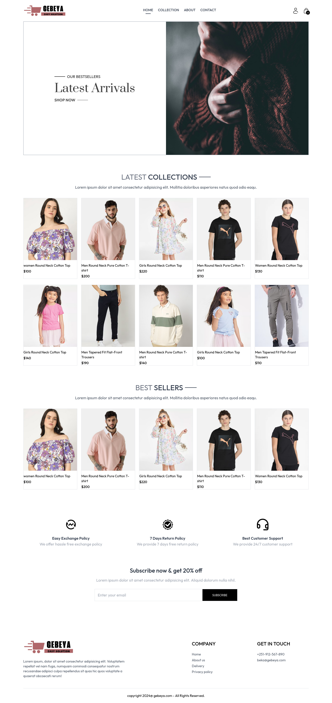

[JAVASCRIPT__BADGE]: https://img.shields.io/badge/Javascript-000?style=for-the-badge&logo=javascript
[REACT__BADGE]: https://img.shields.io/badge/React-005CFE?style=for-the-badge&logo=react
[TAILWINDCSS__BADGE]: https://img.shields.io/badge/Tailwindcss-36b7f0?style=for-the-badge&logo=tailwindcss&logoColor=white
[VITE__BADGE]: https://img.shields.io/badge/Vite-955bf3?style=for-the-badge&logo=vite&logoColor=yellow
[NPM__BADGE]: https://img.shields.io/badge/npm-c53535?style=for-the-badge&logo=npm&logoColor=white
[AXIOS__BADGE]: https://img.shields.io/badge/axios-5a29e4?style=for-the-badge&logo=axios&logoColor=white
[JWT__BADGE]: https://img.shields.io/badge/jWT-d63aff?style=for-the-badge&logo=jsonwebtokens&logoColor=white
[NODE_BADGE]: https://img.shields.io/badge/Node-5FA04E?style=for-the-badge&logo=nodedotjs&logoColor=white
[MONGODB_BADGE]: https://img.shields.io/badge/mongodb-47A248?style=for-the-badge&logo=mongodb&logoColor=white
[EXPRESS_BADGE]: https://img.shields.io/badge/express-000000?style=for-the-badge&logo=express&logoColor=white
[CLOUDINARY_BADGE]: https://img.shields.io/badge/cloudinary-3448C5?style=for-the-badge&logo=cloudinary&logoColor=white

<h1 align="center" style="font-weight: bold; font-size:2.5rem;">GEBEYA: Fully responsive E-commerse website</h1>
<p>
    <a href="https://gebeya-frontend.vercel.app/">go to live frontend website</a> 

<a href="https://gebeya-admin-pearl.vercel.app/">go to live admin website </a> <br/>
<span>admin_email: bekos@gmail.com</span><br/>
<span>admin_password: 123456789</span>
</p>
<div align="center">

![npm][NPM__BADGE]
![vite][VITE__BADGE]
![react][REACT__BADGE]
![javascript][JAVASCRIPT__BADGE]
![tailwindcss][TAILWINDCSS__BADGE]
![node][NODE_BADGE]
![express][EXPRESS_BADGE]
![mongodb][MONGODB_BADGE]
![cloudinary][CLOUDINARY_BADGE]
![axios][AXIOS__BADGE]
![jwt][jWT__BADGE]

</div>

<p align="center">
 <a href="#about">About</a> • 
 <a href="#started">Getting Started</a>  •
 <a href="#routes">Application Routes</a> 
</p>

<p>
    
</p>
<p>
    <a href="./pages_image">click here for more screenshots</a> • 
</p>

<h2 id="started">📌 About</h2>

<p>
This MERN E-Commerce Project is a fully responsive online shopping platform designed to deliver a seamless user experience across all devices. Built with modern web technologies, it includes secure user authentication, product management, shopping cart functionality, and order processing for a complete e-commerce solution.
</p>

Key Features:

=> <span style='font-weight:700;' >User Authentication</span> : Secure registration, login, and password management using JWT (JSON Web Tokens).

=> <span style='font-weight:700;' >Product Catalog</span> : Browse, filter, and search products.

=> <span style='font-weight:700;' >Shopping Cart</span> : Add, remove, and update items with real-time price calculation.

=> <span style='font-weight:700;' >Checkout & Payments</span> : works with cash on delivery for now but can be Integrated with santimpay and arifpay for secure transactions b/c the api are implemented just they don't offer learning platform.

=> <span style='font-weight:700;' >Admin Dashboard</span> : Manage products, orders, and users with role-based access control.

=> <span style='font-weight:700;' >Responsive UI</span> : Mobile-friendly design with React.js & Tailwind CSS.

=> <span style='font-weight:700;' >Order Tracking</span> : Users can view their order history and status.

<h2 id="started">🚀 Getting started</h2>

<h3>Prerequisites</h3>

Here you list all prerequisites necessary for running the project.

- [NodeJS](https://nodejs.org)
- [Git 2](https://git-scm.com/downloads)
- [npm](https://www.npmjs.com)
- [mongoDB atlas](https://www.mongodb.com/atlas)

<h3>Cloning</h3>

```bash
git clone https://github.com/BekaAbate/gebeya.git
```

<h3>Starting</h3>

<p style='font-size:1.2rem;font-weight:700;'>
    frontend:
</p>

```bash
cd frontEnd
npm i
npm run dev
```

<p style='font-size:1.2rem;font-weight:700;'>
    backend: 
</p>

```bash
cd backEnd
npm i
npm run server
```

<p style='font-size:1.2rem;font-weight:700;'>
    admin: 
</p>

```bash
cd admin
npm i
npm run dev
```

<h2 id="routes">📍 Application Routes</h2>

<p style='font-size:1.2rem;font-weight:700;'>
    Frontend:
</p>

| route                          | description                                     |
| ------------------------------ | ----------------------------------------------- |
| <kbd>/</kbd>                   | home page                                       |
| <kbd>/collection</kbd>         | galley for items                                |
| <kbd>/about</kbd>              | about page                                      |
| <kbd>/contact</kbd>            | contact page                                    |
| <kbd>/product/:productId</kbd> | product detail                                  |
| <kbd>/cart</kbd>               | cart page                                       |
| <kbd>/login</kbd>              | page to login and sign up: conditonal rendering |
| <kbd>/placeOrder</kbd>         | place order page                                |
| <kbd>/orders</kbd>             | order page                                      |

<p style='font-size:1.2rem;font-weight:700;'>
    Backend
</p>

| API                              | description                   |
| -------------------------------- | ----------------------------- |
| <kbd>/api/user/register</kbd>    | for registration              |
| <kbd>/api/user/login</kbd>       | for user login                |
| <kbd>/api/user/admin</kbd>       | for admin login               |
| <kbd>/api/product/add</kbd>      | for admin to add product      |
| <kbd>/api/product/list</kbd>     | to get all products           |
| <kbd>/api/product/detail</kbd>   | for individual product data   |
| <kbd>/api/product/remove</kbd>   | for admin to remove a product |
| <kbd>/api/cart/get</kbd>         | for getting cart data         |
| <kbd>/api/cart/add</kbd>         | to add products to cart       |
| <kbd>/api/cart/update</kbd>      | to update a product in cart   |
| <kbd>/api/order/list</kbd>       | for admin to list all orders  |
| <kbd>/api/order/status</kbd>     | for admin to change status    |
| <kbd>/api/order/place</kbd>      | for paymnet with cash         |
| <kbd>/api/order/santimpay</kbd>  | for paymnet with santimpay    |
| <kbd>/api/order/arifpay</kbd>    | for paymnet with arifpay      |
| <kbd>/api/order/userorders</kbd> | for user to list orders       |

<p style='font-size:1.2rem;font-weight:700;'>
    Admin:
</p>

| route                          | description                                     |
| ------------------------------ | ----------------------------------------------- |
| <kbd>/list</kbd>               | for listing all products                        |
| <kbd>/add</kbd>                | to add a new product                            |
| <kbd>/orders</kbd>             | to see all orders                               |


<h4>check the .env files in the project directories to see the enviroment variables used in the project</h4>
